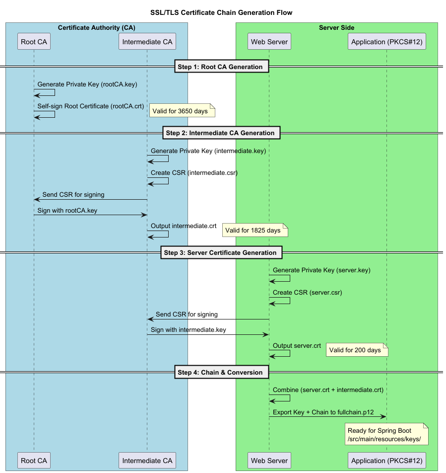

This updated guide provides a precise breakdown of the `cert-chain.sh` script logic and the resulting PKI hierarchy. The documentation now correctly reflects the file naming and procedural steps found in your script.

---

# TLS Setup Tutorial for Spring Boot Application



This guide explains how to implement a manual **Chain of Trust** (Root CA → Intermediate CA → Entity) for a Spring Boot application. This setup mimics a professional Public Key Infrastructure (PKI) environment.

## 📁 Files & Architecture

### Certificate Generation Infrastructure

* **`scripts/cert-chain.sh`**: A comprehensive automation script that manages key generation, CSR creation, and multi-tier signing.
* **`scripts/root.conf`**: Configures the Root CA identity and its ability to sign subordinate authorities.
* **`scripts/intermediate.conf`**: Defines constraints for the Intermediate CA, such as the `pathlen` (limiting the chain length).
* **`scripts/server.conf`**: Specifies Subject Alternative Names (SAN) for `localhost`, essential for modern browser validation.

### Spring Boot Integration

* **`src/main/resources/application.yaml`**: Configures the Servlet container to use the generated PKCS#12 bundle.
* **`.env.example`**: Template for the sensitive `SERVER_SSL_KEY_STORE_PASSWORD` variable.

---

## 🔐 The `cert-chain.sh` Workflow

The script executes a four-step cryptographic process to build a trusted path.

```bash
cd scripts
chmod +x cert-chain.sh
./cert-chain.sh

```

### 1. Root CA (The Anchor)

* **Action**: Generates a 4096-bit RSA key and a self-signed X.509 certificate.
* **Validity**: 3650 days (10 years).
* **Security**: Uses AES-256 encryption for the private key (`rootCA.key`).

### 2. Intermediate CA (The Signer)

* **Action**: Creates a CSR signed by the Root CA.
* **Purpose**: Acts as the operational authority so the Root key can remain "offline".
* **Validity**: 1825 days (5 years).

### 3. Server Certificate (The Identity)

* **Action**: Generates a 2048-bit RSA key and a certificate signed by the Intermediate CA.
* **Validity**: 200 days.
* **Scope**: Validates `localhost` via the `v3_server_req` extensions.

### 4. Bundling (The Delivery)

* **Action**: Concatenates `server.crt` and `intermediate.crt` into `fullchain.crt`.
* **Conversion**: Exports the chain and private key into `fullchain.p12` for Spring Boot compatibility.

---

## ⚙️ Application Configuration

### 1. Keystore Setup

Move the generated bundle to the resources directory:

```bash
cp output/fullchain.p12 ../src/main/resources/keys/

```

### 2. Trust the Root

For your browser to trust the application, you **must** manually import the **`rootCA.crt`** into your system's "Trusted Root Certification Authorities" store.

---

## 📋 Certificate Files Reference

| File | Type | Secret? | Destination |
| --- | --- | --- | --- |
| **`rootCA.key`** | RSA Key | **YES** | Secure Offline Storage |
| **`rootCA.crt`** | X.509 | NO | Client OS Trust Store |
| **`intermediate.crt`** | X.509 | NO | Bundled in Full Chain |
| **`server.key`** | RSA Key | **YES** | Web Server / Keystore |
| **`fullchain.p12`** | PKCS#12 | **YES** | `src/main/resources/keys/` |

## 🔍 Verification

Once the app is running on `https://localhost:8443`, verify the chain:

```bash
openssl s_client -connect localhost:8443 -showcerts

```

You should see a depth of **2**, tracing back from the server to your custom Root CA.
